# Deano codebase map

Source-oriented orientation, checked on 15 September 2026. Read [AGENTS.md](../AGENTS.md) for working rules and [the handover](codex-handover.md) for the verification boundary. Paths below are relative to the repository root. This describes the implementation, including places where it has not yet met its intended contract.

## System at a glance

```mermaid
flowchart LR
  Tools[Agent hooks, Codex logs, folder saves and Git] --> Connector[Local connector]
  Connector --> Normalise[Normalise and strip private contents]
  Normalise --> Spool[Disk spool]
  Spool --> Ingest[Web ingest route]
  Ingest --> Store[Local JSON or Supabase]
  Store --> Derive[Compute views from facts and area map]
  Derive --> Room[Glasshouse Room, reports and digest]
  Derive --> Shed[Potting Shed]
  Ingest --> AI[Optional AI wording]
  AI --> Store
  Owner[Owner in Room chat] --> Requests[Recorded requests]
  Requests --> Runner[Local connector request runner]
  Runner --> Agent[Local agent CLI]
  Agent --> Tools
  Shed --> Files[Compile helper instructions]
  Files --> Place[Owner runs glasshouse helpers]
```

The web app and the local connector have different jobs. The server stores and presents the record; the connector observes local activity and launches only the requests the owner addressed to tools. Optional AI enriches wording after factual views are available.

## Packages and build

| Location | Role | Main entry points |
| --- | --- | --- |
| `packages/schema` | Shared Zod contracts | `src/index.ts`: tools, event kinds, stages, normalised events, batches, areas, project trees, fixtures |
| `packages/translate` | Pure conversion and interpretation | `src/index.ts` exports the normalisers, templates, stage/risk/continuity/report/digest helpers |
| `packages/connector` | `glasshouse` Node CLI | `src/cli.ts`, bundled by `tsup.config.ts` into `dist/cli.js` |
| `apps/web` | Next.js 15 / React 19 application | `src/app`, `src/components`, `src/lib`, `src/styles` |
| `supabase` | Hosted database definition | Six ordered migrations and local Supabase configuration |
| `fixtures` | Curated recordings and synthetic examples | `sessions`, `rollouts`, and the passive raw recorder |
| `scripts` | Development utilities | Seed demo, hosted test account, visual/contrast audit |

The dependency direction is schema → translate → connector/web. Schema and translate expose TypeScript source; their build commands validate types. Next transpiles them and resolves `.js` package imports to `.ts`/`.tsx`. The connector bundles its shared code and Zod into one ESM executable. The web app is not a static site: most pages and routes are dynamic.

## Event to Room card

1. **Capture.** `connector/src/register.ts` merges owned listener entries into tool settings and backs up existing files. `cli.ts` links a folder with a project/token. `hook.ts` gets the payload's folder, selects the most specific linked root and dispatches a normaliser. Hooks' outer error handling keeps agent runs unaffected.
2. **Normalise.** `translate/src/normalise/claude-code.ts` contains the shared hook mapper and content stripping. `codex.ts` adapts hook IDs/names; `cursor.ts` adapts Cursor's distinct fields. `codex-rollout.ts` is a stateful reducer over one log file, correlating calls/results and tracking turns, messages and rate-limit evidence. Unknown/unobserved fields should lead to thinner evidence, not invented facts.
3. **Watch other activity.** `connector/src/watch.ts` debounces folder changes, polls Git and Codex logs, and remembers offsets/commits. `git.ts` reads local commits; there is no GitHub webhook or GitHub API ingestion in this checkout. `codex-tailer.ts` reads recent `rollout-*.jsonl` files under `sessions`, attaches them by `session_meta.cwd`, and derives stable event IDs from file/line.
4. **Spool and upload.** `spool.ts` writes one JSON file per event, groups by project and sends batches with a bearer token. Concurrent retries can resend IDs. Transient failures keep the spool; old failed events and terminal 4xx batches are dropped by current policy. `upload.ts` sends the project tree separately.
5. **Authenticate and reduce.** `app/api/ingest/route.ts` resolves the token, validates `EventBatch`, replaces every submitted project ID with the token's project, calls `Store.ingest`, publishes an update, then starts optional AI work. Sessions use project/tool/external session identity; tasks use session plus external task/turn key.
6. **Store facts.** `lib/store/derive.ts` applies events to `TaskState`, retains changed/looked-at paths, test results, errors, installs, ending reasons and continuity facts. Helper edits contribute to task facts without driving the parent's stage; a helper stopping must not end the parent task. A finished task gets a template report immediately.
7. **Read current views.** Both stores feed shared derivation with the current area map and file descriptions. `viewTask` builds risk, stage overlay, touched/not touched, location and report facts. A rename therefore changes old views without rewriting past events. `getRoom` composes sessions, story, progress, activity, helpers, requests and listening state.
8. **Apply the viewer's plan.** `lib/room.ts` and `lib/plan.ts` apply the same gates on initial page render and later API refreshes. `Room.tsx` refreshes from `/api/room/[projectId]`, listens to `/api/live` and polls every ten seconds. The SSE notification bus is local to one server process.

Important distinction: de-duplication of event rows is not proof that task-state updates are idempotent. The Supabase reducer currently runs before event insertion removes duplicate IDs; this needs correction and hosted replay testing (handover).

## Translation and evidence

| Module in `packages/translate/src` | Responsibility |
| --- | --- |
| `classify.ts`, `tests-output.ts` | Identify shell command kinds and parse real test counts |
| `areas.ts` | Longest-prefix area matching, heuristic tree mapping, rename/merge, preserve owner corrections |
| `files.ts`, `templates.ts` | Plain-English nouns and action lines with evidence references |
| `stage.ts` | Event-driven stages, waiting/resume, stuck overlay: repeated errors or five minutes of working-stage inactivity |
| `risk.ts` | Reasons derived from sensitive areas/files, failed checks and dependency changes |
| `headline.ts` | Meaning-change triggers and free template headlines |
| `continuity.ts` | Link nearby tasks across tools using time, area overlap, prompts and usage-limit evidence; show the reason |
| `report.ts` | Report facts/words, needs-you floor, guarded AI merge, changed-file diff reconstruction |
| `digest.ts` | Since-checked/today/week windows, done/going/needs-you/new-area summaries |
| `helper-files.ts` | Shared instruction-file format and marked-section merge/removal |

`raw` in the server is a stripped representation, not a licence to upload full source. Claude structured patches for non-secret changed files are retained for report/Ask context. Codex patch bodies are reduced to paths; Cursor file contents are removed. Project trees carry paths and limited manifest/README metadata. See `normalise/claude-code.ts`, `connector/src/tree.ts` and the fixture privacy notes before changing capture.

## The two stores

`lib/store/types.ts` defines the shared interface and view types. `getStore()` selects Supabase when both `NEXT_PUBLIC_SUPABASE_URL` and `SUPABASE_SERVICE_ROLE_KEY` are set; otherwise it creates `MemoryStore` with file persistence. Hosted authentication also needs `NEXT_PUBLIC_SUPABASE_ANON_KEY`.

`MemoryStore` holds rows in memory, maintains lookup indexes and saves its JSON file on a short debounce. It supports an injected clock and a disposable/no-persistence instance for tests. It is a single-process development store, with bounded retained events. `SupabaseStore` maps the same interface onto tables via the server-only service role; ownership checks at routes are essential because service-role access bypasses database row policies.

| Data | Tables / equivalent local structures |
| --- | --- |
| Project identity and connection | `projects`, `project_tokens` (hashed tokens), `link_codes` |
| Project vocabulary | `areas`, `file_descriptions`, tree metadata on `projects` |
| Observed work | `agent_sessions`, `tasks`, `events`; `tasks.state` is the current factual task model |
| Memory and feedback | `reports`, `digests`, `translation_feedback`, project last-checked timestamp |
| Accounts and billing | `profiles`, `invites` |
| Operating the private test | `tester_notes`, `metrics`, `ai_calls` |
| Helpers | `helpers`; runs/verdicts are derived, not separate stored run records |
| Requests | `requests`, `request_questions`, project listening timestamp |

Migrations are `20260903000000_init`, `20260904000000_phase2`, `20260905000000_phase3`, `20260906000000_phase4`, `20260909000000_phase6`, `20260914000000_phase8` (all `.sql`). Some legacy SQL columns are snapshots; do not make them a second source for facts already held in `TaskState`.

The stores intend to present the same behaviour. They currently differ in retry handling and the Room's session-history query; local tests do not verify real Supabase constraints, policies or concurrency. See the handover before deployment work.

## Requests and the project chat

`Conversation.tsx` is the composer, address book, suggestions and mixed story. `lib/requests/compose.ts` resolves recipients and the copy-for-pasting case; `suggest.ts` produces proposals from task facts; `story.ts` adds owner messages, request outcomes and open questions to the story.

`POST /api/requests` authorises the project and distinguishes two paths:

- **Glasshouse question:** `requests/glasshouse.ts` reads the plan-filtered record. `answers.ts` handles the built-in summary/next-step/agent-status intents. Other questions use `ai/room-ask.ts` when allowed, with an honest template response otherwise. The answer is saved as a request with status `answered`.
- **Agent instruction:** save the text, tool, origin, care, optional continuation and status `queued`. For a new Claude Code run the server preselects the external session ID. The server does not spawn a process.

`connector/src/requests.ts` long-polls `/api/requests/next`, atomically claims via `/[id]/take`, runs the local tool in the linked folder and reports `/[id]/status`. It reads closing text and external IDs from the tool's output. Follow-ups in the same external session queue behind the current run. A queued request expires after ten minutes; this is separate from a running process's timeout. Request lifecycle is queued → taken → running → finished/failed, with expired/withdrawn/answered alternatives.

Current launch adapters are Claude `-p` / `--resume`, Codex `exec` / `exec resume`, and Cursor `-p` / `--resume`. `launchFor` defines the actual arguments. The two care settings intentionally choose different tool permissions; the existing automated checks simulate the processes, not actual installed agents.

`connector/src/mcp.ts` is the Claude permission/question bridge. Temporary per-run configuration gives Claude the connector's `ask_owner` MCP tool. It sends a question to `/[id]/questions`, waits for an answer, and returns the tool's expected decision format. Owner answers use `/[id]/answer`; connector polling uses `/[id]/questions/[questionId]`. Both stores preserve the first answer. The bridge defaults to a thirty-minute wait and raises Claude's tool timeout to cover it. Codex and Cursor adapters currently have no equivalent question bridge.

## Potting Shed

`components/Shed.tsx` renders the single-card builder, existing helpers and supporting evidence. `lib/shed/view.ts` gathers the latest area map, helpers, up to 400 tasks and helper runs; evidence looks back up to fourteen days, clipped by the plan's history limit.

- `build.ts`: the six kinds, duty/voice/stop sentences, defaults, name suggestions, and exact `Choices` ↔ `HelperBrief` conversion. Fixed sentences act as persisted identifiers; copy edits need compatibility care.
- `input.ts`, `slug.ts`: validation, unique safe slugs, comparison of briefs.
- `evidence.ts`, `suggest.ts`: reasons/counts/task references behind boxes and helper suggestions.
- `rehearse.ts`: evaluates the chosen rules against the latest twelve task summaries. This is a factual retrospective, not an agent run.
- `compile.ts`: generates tool-specific files from the brief and current area prefixes on read.
- `runs.ts`, `verify.ts`: derive runs from sub-agent start/stop/edit records and compare changed paths with allowed/forbidden areas. Where attribution is task-wide, an apparent violation is unclear rather than an accusation.
- `room.ts`: the helper panel, history lines and verdicts reused inside Glasshouse.

`/api/shed/[projectId]` manages helper records, `/api/shed/draft` optionally tidies a typed sentence with AI, and bearer-token `/api/shed/pull` provides compiled files and acknowledges placement. `connector/src/helpers.ts` performs explicit placement, preserves surrounding AGENTS text and tracks managed files/sections for later removal. It does not automatically install helpers during `watch`.

## Pages and feature ownership

| Surface | UI / supporting code |
| --- | --- |
| Front door and landing | `app/page.tsx`, `components/ProductPicker.tsx`, `Landing.tsx`, `Demo.tsx`, `lib/demo.ts`, `demo-chapters.ts` |
| Room | `app/room/[projectId]/page.tsx`, `Room.tsx`, `AgentCard.tsx`, `Conversation.tsx`, `Progress.tsx`, `lib/story.ts`, `progress.ts` |
| Task detail and report | `TaskPanel.tsx`, `ReportCard.tsx`, `/api/task`, `/api/report`, `/api/ask` |
| Digest and inbox | Nested Room pages, `DigestView.tsx`, `Inbox.tsx`, `/api/digest`, `/api/inbox` |
| Area editing | Nested `areas` page, `AreasEditor.tsx`, `/api/areas`, project-tree upload |
| Translation feedback | `FeedbackReview.tsx`, `/api/feedback`; keeps what the owner actually saw |
| Onboarding | `Connect.tsx`, `Walkthrough.tsx`, `lib/moment.ts`, project link/code routes |
| Accounts | `AuthForm.tsx`, `AuthScreen.tsx`, `Account.tsx`, middleware, auth/credentials/supabase helpers |
| Plans/payments | `UpgradePanel.tsx`, `lib/plan.ts`, `lib/billing.ts`, billing routes |
| Private-test operations | `Admin.tsx`, `ReportProblem.tsx`, `/api/admin`, `/api/notes`, `/api/metrics`, `lib/visitor.ts` |

Hosted signup currently creates an already-confirmed Supabase user through the admin API and signs in with a password; there is no email confirmation flow in the implemented route. `rememberProfile` logs bookkeeping failures without blocking a successful login. Stripe checkout/portal are optional; verified webhook events and the admin switch update plans. The current mapping treats active, trialing and past-due subscriptions as Pro.

Free currently permits one project, one visible active agent, 24 hours of history and two helpers. Additional agents' events are still stored. Pro opens history, digest, inbox, Ask and helper limits. Both tiers may launch owner-requested agents; template questions to Glasshouse also work on Free.

## Optional AI

All provider access goes through `lib/ai/client.ts` and `askForJson`, with schema validation, failure fallback and token/cost logging. Call sites cover area naming, file descriptions, meaning-change headlines, one report per completed task, cached digest openings, task Ask, Room Ask and helper drafting.

`workers.ts` starts background work in the web process; it is not a durable queue. A serverless shutdown can interrupt it. `headline.ts` controls coalescing; `digest.ts` caches by the facts' fingerprint. Without AI, reports remain template-based and before/after text can be absent; the product must say what is unavailable rather than fabricate it.

## Design and verification navigation

The CSS layers are `tokens.css`, `base.css`, `components.css`, `screens.css`, `room.css`, `deano.css`, imported in that order by `app/globals.css`. Reuse existing components and classes, including the landing's fixture-driven Room demonstration. [Design system](design-system.md) is the detailed source for tokens, typography, interaction, responsiveness and accessibility.

| Change | Existing checks to start with |
| --- | --- |
| Payload shape or privacy | `packages/schema/src/*test.ts`, `packages/translate/src/normalise/*test.ts`, `packages/connector/src/hook.test.ts` |
| Stages, language, area/risk/report/digest rules | Corresponding `packages/translate/src/*.test.ts`; `lib/store/memory.test.ts`, `phase3.test.ts`, `lib/room-facts.test.ts` |
| Watching or registration | `packages/connector/src/watch.test.ts`, `register.test.ts`, `tree.test.ts` |
| Requests and questions | Connector `requests.test.ts`, `mcp.test.ts`; web `lib/requests/*.test.ts`, `app/api/requests/requests.test.ts` |
| Helper building/export/verification | `lib/shed/shed.test.ts`, connector `helpers.test.ts` |
| Account/plan/route handling | `lib/phase4.test.ts`, `lib/answer.test.ts`, `app/api/routes.test.ts`, ingest route check |
| Appearance | Isolated demo, browser inspection, `scripts/design-screenshots.mjs` at 390px/1440px |

Vitest runs Node tests selected by the root `vitest.config.ts`. Routes are exercised with local stores and mocked dependencies; these are not a browser suite or hosted database suite. The seeded demo and design audit are separate manual utilities. See README for commands and the handover for the exact checks performed during this migration.
