# Deano: what was built overnight, with screenshots

Written for Christopher on 9 September 2026. Every picture below is a real screenshot of the product running on this
computer with demo data, taken by the design-QA script (`node scripts/design-screenshots.mjs`), at a desktop width
(1440px) and a phone width (390px). Nothing is a mockup.

## In one paragraph

The website is now called **Deano**. It has two products inside it. **Glasshouse** is the control room you already had:
it watches your AI coding agents and tells you, in plain English, what they are doing. **Potting Shed** is new: it is
where you build helpers (small specialist agents) for your project by answering a few plain questions, without writing a
single line of anything technical. When you sign in you land on a front door that shows both products side by side, and
you pick one. Every product screen has a "Products" link at the top-left that takes you back to that front door, and the
front door has a "Landing page" link that takes you back out again.

## 1. The front door

After sign-in (or straight away when running on your own computer) you see this. Each card carries one live fact
computed from the record: how many agents are working right now, whether any is waiting for you, how many helpers you
have grown and placed. The greeting changes with the time of day. The "Landing page" link at the top-left goes back
out to the landing page.

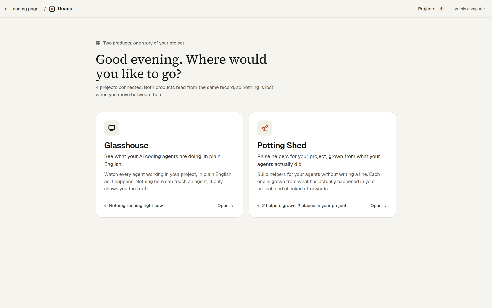

On a phone the two cards stack.

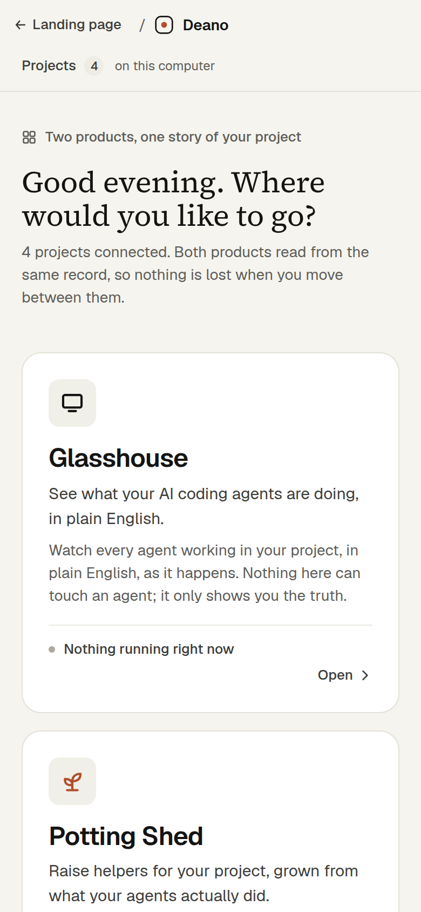

## 2. The way out of a product

The Room (Glasshouse) is unchanged except for its top-left corner: a "Products" link before the product's name leaves
the product and goes back to the front door with the two products. The Potting Shed has the same link in the same
place. The product name itself goes to that product's own door (your list of projects).

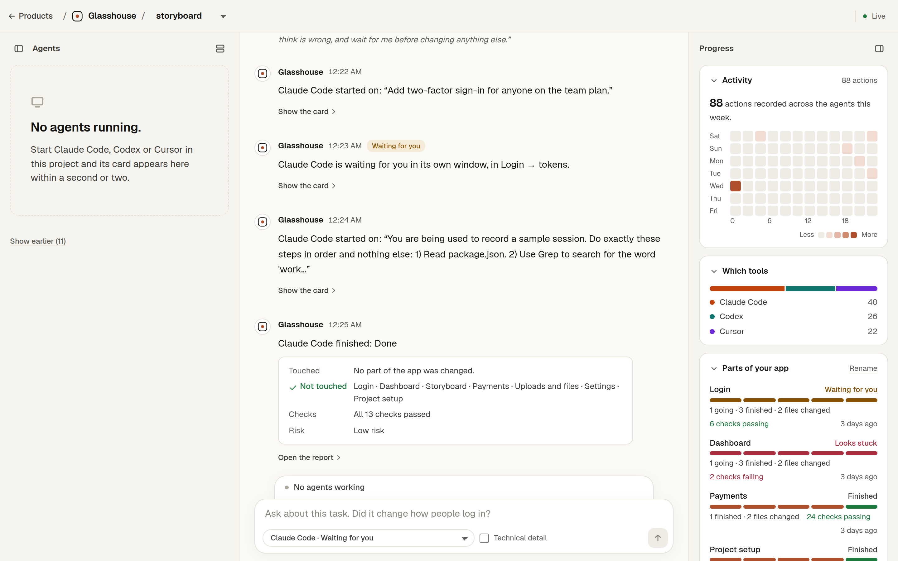

## 3. The Potting Shed

The Shed is laid out exactly like the Room, so the two feel like one place: your helpers on the left, the builder in the
middle, and on the right what your project has already taught us. Below 960px the three columns become three tabs.

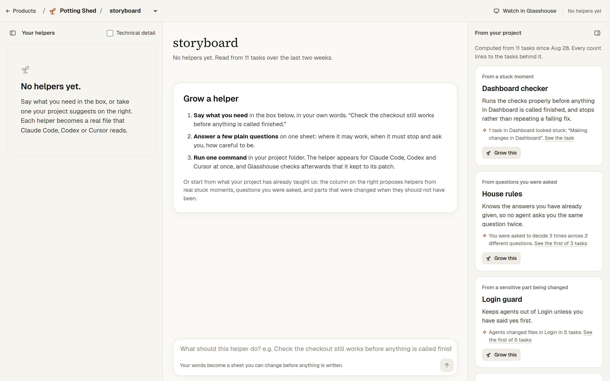

### What makes it different from every other agent builder: it has watched your project

The right-hand column does not offer templates. It proposes helpers computed from what has actually happened in this
project over the last two weeks, and every proposal says how often the thing happened and links to the tasks behind it:

- **From a stuck moment**: an agent hit the same error three times in the Dashboard, so a "Dashboard checker" is
  proposed that runs the checks properly and stops rather than repeating a failing fix.
- **From questions you were asked**: you had to decide something three times across two different questions, so "House
  rules" is proposed, pre-filled with those questions for you to answer once.
- **From a sensitive part being changed**: agents changed files in Login in five tasks, so a "Login guard" is proposed.
- Also: a "Finisher" when tasks were called done with failing checks, "Handover notes" when work moved between tools,
  and a specialist for the busiest part of your app.

When the record is empty, two starters are offered and they say plainly that they are not from your record.

### Growing a helper from a suggestion

Pressing "Grow this" opens one sheet in the middle column. Six questions, in a fixed order, all in plain words:

1. What it does (already written; change anything).
2. Where it may work: tap a part of your app once to allow it, twice to keep it out. Sensitive parts start out kept out.
3. When it must stop and ask you: tick boxes, or add your own moment.
4. How carefully: Careful, Balanced or Quick. Three stages, never a number.
5. Things it should already know: your standing answers, each one showing which task it came from.
6. Which tools: Claude Code, Codex, Cursor, or any mix.

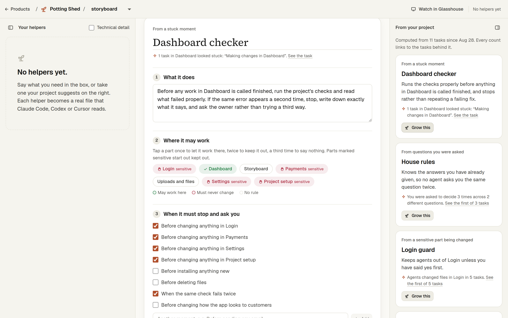

The same sheet on a phone, top to bottom:

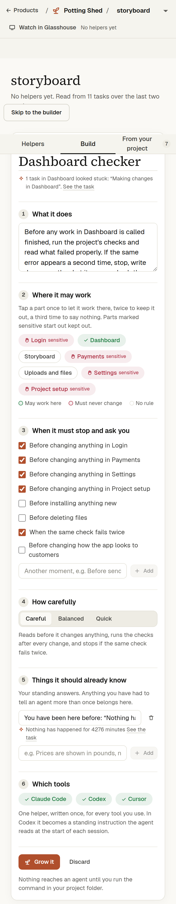

### Growing a helper from your own words

You can also type one sentence in the box at the bottom, the same box the Room uses for questions. It becomes a sheet.
With an AI key set, the sentence is tidied into a name, a clearer job and a first guess at the boundaries (choosing only
from parts of your app that really exist). Without a key, as here, your words are used exactly as typed and the sheet
says so.

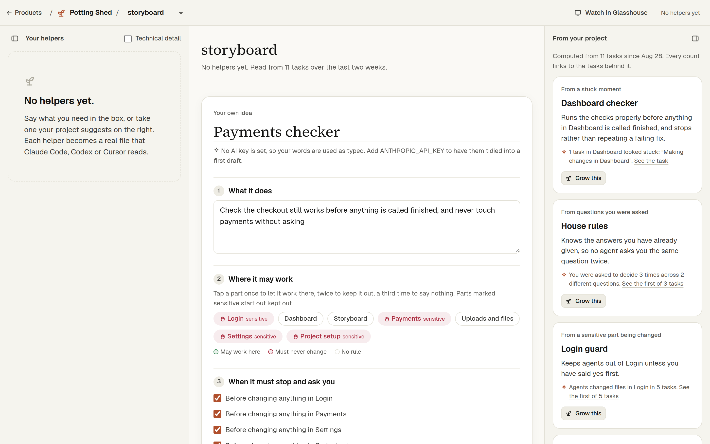

### A helper that has run, checked afterwards

This is the "shop" demo project, where the "Checkout checker" helper has already run three times. Its card says
"In your project" (the connector reported that it wrote the files) and, in red, "Ran 3 times; went outside its patch
once (Payments)". That line is computed from the files the helper's runs actually changed, never from what the helper
said. Under Details you can see each run's verdict with a link to the task, and the exact file each tool reads, with a
Copy button.

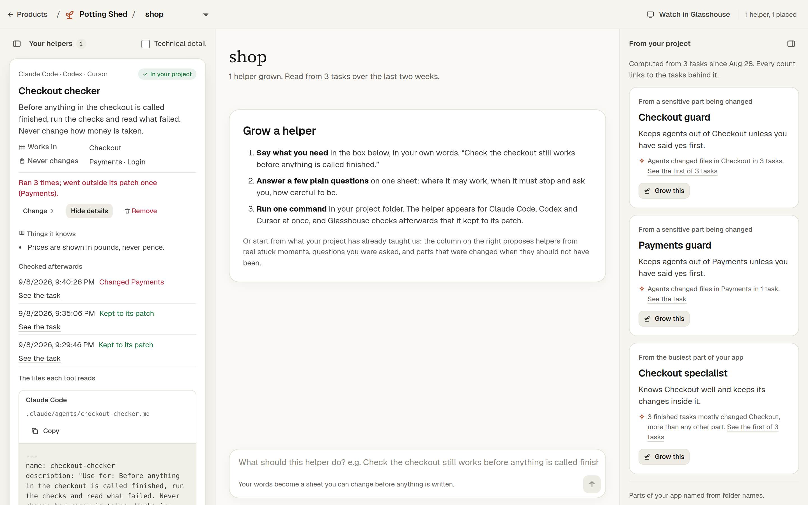

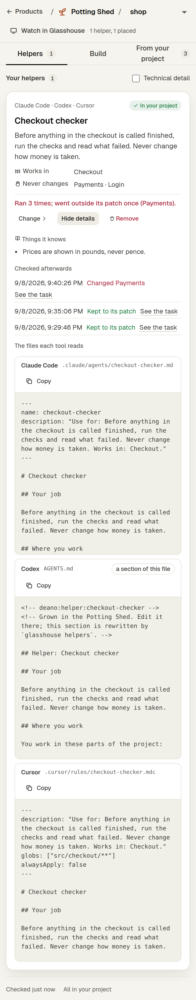

### Putting a helper into your project

The Shed never writes into your project folder by itself. After "Grow it", the card tells you to run one command in the
project folder:

```
npx glasshouse helpers
```

It writes the helper's files (a Claude Code sub-agent, a Cursor rule, and a marked section of the file Codex reads at
the start of every session), prints every file it wrote, and tells the Shed they are in place. This was tested end to
end on this computer: a temporary folder was connected, a helper grown, the command run, and the three files appeared
with the owner's own notes in the Codex file left untouched.

### The empty Shed, and picking a project

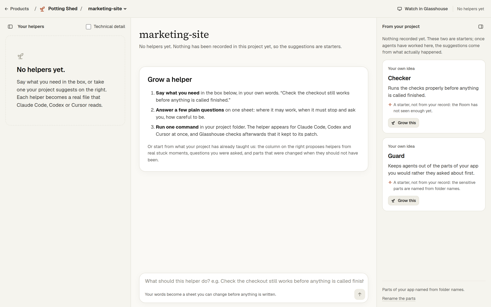

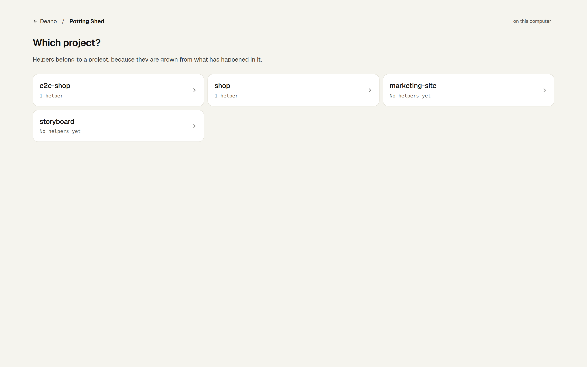

## 4. Names, and what needs your decision

- **Deano** is the website, as you asked.
- **Glasshouse** stays as the control room's name.
- **Potting Shed** is my choice for the agent builder: the place beside a glasshouse where young plants are raised
  before they go out. It says what the product does, in the same garden as Glasshouse, and no agent builder on the market
  uses it. Agents and sub-agents are called **helpers** everywhere you look. All three are one setting each, so changing
  your mind costs nothing.
- Free grows two helpers per project; Pro grows as many as you like.
- The full list of what only you can do is in `docs/what-christopher-needs-to-do.md` (Phase 6 section): apply the new
  database migration when you set up Supabase, grow one real helper and run it, and decide whether placing should ever be
  automatic.

## 5. What was checked

- All 186 automatic checks pass (24 existing files plus the new ones for the Shed's logic, the store, and the connector's
  new command).
- The two code scans (typecheck and lint) pass.
- The production build passes.
- Every screen was screenshotted at both widths and audited for text contrast; no failures.
- What was found along the way, and what is deliberately left for later, is in `docs/phase-6-findings.md`.
