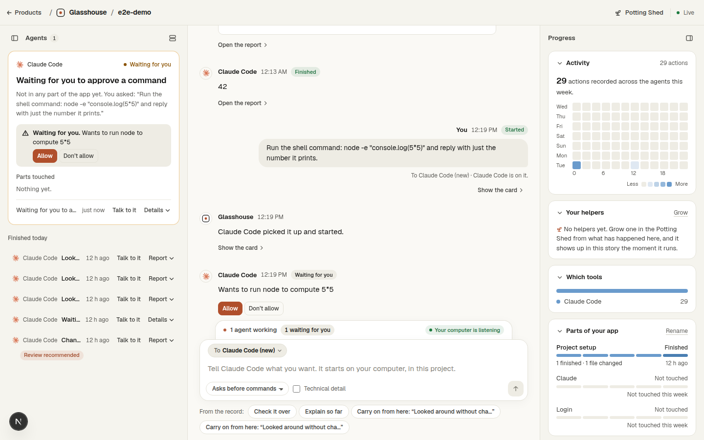
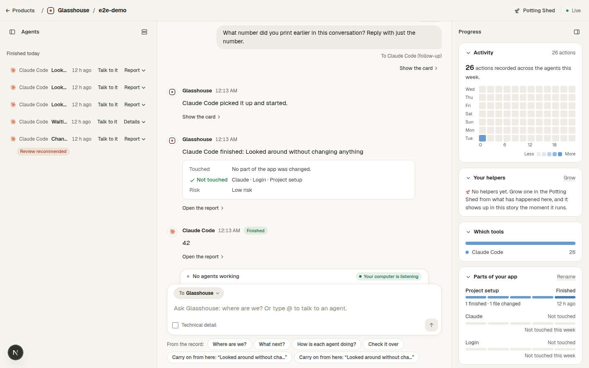

# Phase 8 findings: the Room can ask

Built on 14 and 15 September 2026 from Christopher's brief: a web app that only watches, while the asking happens in
a terminal in another window, is "a bit pointless"; he wanted to start agents, prompt them and tag them from
Glasshouse, with the middle column working as a group chat for all of them, ready-made prompts to tap, and a
Glasshouse agent to ask for a summary or what to do next. He also asked for the reasons it would stand out from the
products that already do this (T3 Code and the labs' own web products). The reasoning, in short: the difference is
who it is for and where the words come from. Every one of those products is a chat box in a browser for developers.
Here the words come from the record, the run lands in the same story with the same computed facts, and the agents
run on the owner's own computer on the owner's own subscription.

## What was built

- **The story is the group chat.** The box at its foot is the owner's. With no one named, the words are a question
  to Glasshouse. Typing `@` opens the address book: Glasshouse; every agent in the Room today (working, or finished
  and able to pick up where it left off); and New Claude Code, New Codex, New Cursor. "Talk to it" on any card names
  that agent. The To box goes back to Glasshouse after every message to an agent, so nothing starts a run by accident.
- **A request is a row of words** (`requests` and `request_questions`; `lib/requests/*`): the owner's text, who it is
  for, how freely, where the words came from, the tool's own session id, and what the process reported. What the run
  became (its session, its task, the plain lines) is looked up from the record when read, never stored. Its stages:
  queued, taken, running, finished, failed, expired (nobody listening within ten minutes), withdrawn, answered.
- **The connector takes it.** `glasshouse watch` is now also the request taker: it holds a long poll open on
  `/api/requests/next`, claims a request atomically (`/take`), starts the tool in the linked folder, and reports
  `/status`. Claude Code runs as `claude -p` under a session id the Room chose (`--session-id`), so the hooks that
  fire from that run link its card from the first action; a follow-up is `--resume` of the same session, queued behind
  any run of that session still going. Codex is `codex exec … --json` with the prompt on stdin (`resume <thread>` for a
  follow-up), its thread id read from the first JSON line. Cursor is `cursor-agent -p --output-format stream-json`
  (`--resume` for a follow-up). Start with `--no-requests` to refuse them. `start-watch.cmd` is the Windows launcher.
- **Questions come back to the Room.** `glasshouse mcp` is a small MCP server (JSON-RPC over stdio, written by hand,
  no SDK) that the connector hands to Claude Code with `--permission-prompt-tool mcp__glasshouse__ask_owner`. Every
  permission Claude Code cannot grant itself, and every `AskUserQuestion`, arrives as one tool call; the bridge posts
  it to the Room, waits for the owner's tap (up to thirty minutes; `MCP_TOOL_TIMEOUT` is raised to match, because
  Claude Code's default is one minute and it retries), and answers in the shape Claude Code expects. The Room shows
  the question in the story and on the card, the one thing allowed to light up, as "Wants to run the checks" with
  Allow and Don't allow, or the agent's own question with its options as buttons. The first answer stands.
- **Every plain line is the record's.** "Wants to run the checks" is the same template that writes "Ran the checks",
  turned by one small verb table (`wantsTo`); the agent's own one-line description is used when it gave one. The real
  command and the paths sit behind Technical detail (rule 3).
- **Ready-made lines** (`lib/requests/suggest.ts`): unstick it (the task looks stuck), fix the failing checks (n
  checks failed), answer its question (the report asked one), pick it up with Codex (Claude Code ran out of usage),
  check it over (review recommended), carry on from here (it finished), write checks for it (none were run and files
  changed), run a placed helper (Claude Code takes helpers by name). Each carries the fact it rests on and the task it
  came from; two with the same words name their task. Tapping one fills the box; the owner can change the words.
- **Glasshouse answers on its own** (`lib/requests/answers.ts`): "Where are we?" (what is running, what is waiting on
  your answer, what finished today with its checks, what needs you, which parts were touched this week), "What next?"
  (the ready-made lines with their facts), "How is each agent doing?" (one line per agent). Anything else goes to the
  AI with the same facts plus the actions of one task when the question is about it (`lib/ai/room-ask.ts`), and
  without a key, or on Free, says plainly what it can and cannot do. Answers persist as rows, so the chat survives a
  reload.
- **Its closing words come back as its own message**, under the maker's mark, from the process's JSON result. The
  Stop hook does not reliably reach the Room from a `claude -p` run (the process exits before an asynchronous hook
  has flushed), so the closing words in the chat come from the result, not the hook; the SessionEnd hook does arrive
  and ends the task as before.
- **"How freely"** is two settings, stated per tool on the control: "Asks before commands" (Claude Code:
  `acceptEdits` plus the bridge; Codex: its `workspace-write` sandbox, which cannot ask; Cursor: no `--force`, so
  commands it is not already allowed to run are not run) and "Runs commands freely" (`bypassPermissions`;
  `--dangerously-bypass-approvals-and-sandbox`; `--force`).
- **Rule 4 rewritten, not dropped.** Hooks and connectors still never block or alter a running agent. The one way words
  go the other way is a request the owner made, taken by their own connector, on their own computer, shown in the story
  with who asked and what was run. The Room never runs anything itself.

## Verified end to end, here

On this Linux machine, with Claude Code 2.1.271 signed in, a local Room (`next dev`), a temporary project linked with
project-level hooks, and `glasshouse watch` running:

1. A request typed in the chat for a new Claude Code started within a second, created the file it was asked for, and
   its card, story lines and report appeared from the hooks exactly as for a terminal run. The request linked to that
   session and task. The MCP config file written for the run was removed afterwards.
2. A request needing a command waited for the owner: the question appeared in the Room ("Wants to run node command to
   print 6 times 7", with the command behind the toggle), the card lit up "Waiting for you", Allow was tapped **eighty
   seconds later**, and the run went on and finished with "42".
3. Don't allow was tapped on another: Claude Code said it was not allowed to run the command and stopped.
4. An `AskUserQuestion` ("Do you prefer the colour red or the colour blue?") arrived with its two options and header.
5. A follow-up to the finished "42" session ("What number did you print earlier?") was resumed with `--resume` and
   answered "42": the agent kept what it did in mind.
6. Driven through the browser with Playwright: "@new claude" picked New Claude Code, the message was sent, the
   question appeared on the card and in the story, Allow was clicked, and the run finished with the right number.
   No console errors at 1440px or 390px.

## What was found on the way

- **A store split in two, in development.** `getStore()` kept one store on `globalThis` behind an `instanceof` check.
  In `next dev` each route is bundled with its own copy of the store classes, so a route compiled later (the first
  hit on `/answer`) failed the check, built a second store from the same file, and the two took turns overwriting
  each other's saves: an answer written by one route vanished under the next save from another, and a Stop event was
  lost the same way. The guard now checks by the methods every store must have (the ones both store classes define),
  so all routes share one store and a code change that adds a method still rebuilds it. This was a real bug for any
  long-lived request in development; production builds share one bundle and never showed it.
- **Claude Code times an MCP tool call out at sixty seconds by default and retries**, so a permission that waits for
  a person needs `MCP_TOOL_TIMEOUT` raised. Found by waiting; fixed; then verified with an eighty-second wait.
- **`ls -la` needs no permission**: read-only commands run without asking in every mode, so the first test never asked.
- **Answers to a multiple-choice question must be keyed by the question's exact text**; the bridge now also accepts
  a key that differs only in spacing or case, and a lone answer to a lone question.
- **Codex and Cursor are unverified here**: neither is installed in this environment. Their commands come from their
  documentation as of 14 September 2026 (`codex exec -C … --sandbox workspace-write --json -`, `codex exec resume
  <thread> -`; `cursor-agent -p --output-format stream-json --workspace … --trust [--force] [--resume <id>]`). The
  connector says plainly, in the chat, when a tool is not installed or stops with an error, and the real command is
  under Technical detail. Two open points from the research: Cursor's docs do not state that the `session_id` it prints
  is the id `--resume` takes (third-party tools rely on it); and Codex hooks in `exec` mode are not documented, so a
  Codex run started from the Room is followed through its rollout log by the same `watch` process, as before.

## Decisions taken, and the ones left for Christopher

- Not gated by plan: Free and Pro can both ask from the Room. The run costs the Room nothing. Gating is one line in
  `lib/plan.ts` if wanted (`docs/what-christopher-needs-to-do.md`).
- A request nobody took within ten minutes expires and is never run: a connector started an hour later must not run
  what was asked for while it was off.
- A follow-up to a running session waits for that run to end (two `claude -p` processes on one session would trample
  its transcript). The chat says "Starting" while it waits. Reaching a run mid-turn (stream input) is left for v3.
- The address book only reaches agents the Room started or that have finished. An agent working in its own window is
  out of reach, and the box says so and copies the words instead: honest, and rule 4 on the agents' side.
